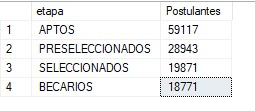
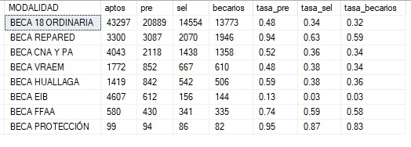
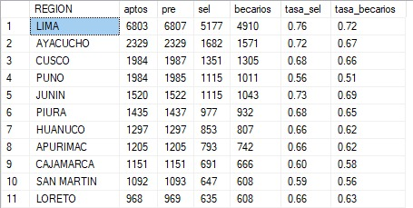
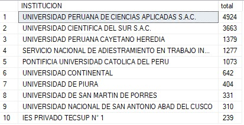
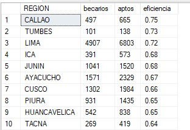
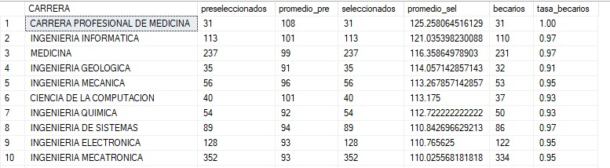
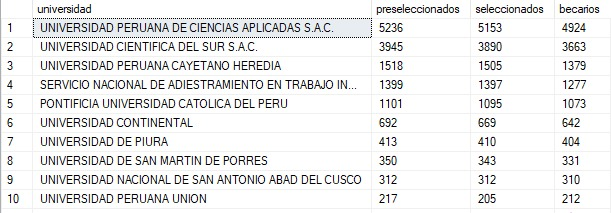
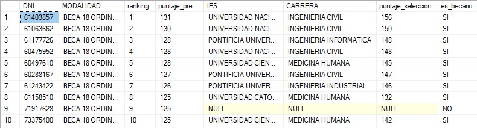
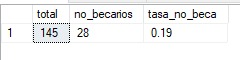
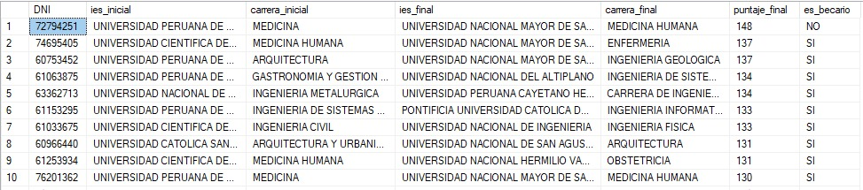

# 🎓 Beca 18 Analytics  
## Proyecto SQL: Análisis del proceso de selección de becarios en Perú

---

## 📌 Resumen (Overview)

El programa **Beca 18** busca brindar oportunidades educativas a jóvenes talentosos en situación vulnerable en Perú. Sin embargo, el proceso de selección involucra múltiples etapas (aptos, preseleccionados, seleccionados y becarios), lo que dificulta entender el comportamiento de los postulantes y la eficiencia del sistema.

El objetivo de este proyecto es construir un análisis end-to-end utilizando **Python y SQL Server**, para transformar datos extraídos desde PDFs oficiales en información accionable que permita:

- Entender el funnel de postulantes
- Evaluar tasas de conversión
- Identificar patrones de éxito
- Detectar oportunidades de mejora en el proceso

---

## 🧠 Objetivos del Proyecto

- Analizar la evolución de postulantes a través de las etapas del concurso
- Identificar qué modalidades, regiones y universidades tienen mayor éxito
- Evaluar qué tan competitivo es el proceso por carrera
- Detectar comportamientos como cambios de carrera o abandono del proceso
- Generar insights basados en datos para toma de decisiones

---

## 🛠️ Tecnologías Utilizadas

- **Python (Google Colab)** → Extracción de datos desde PDFs
- **pdfplumber / pandas** → Limpieza y transformación
- **SQL Server** → Modelado y análisis
- **GitHub** → Documentación y versionamiento

---

## 🔄 Pipeline del Proyecto

### 🔹 1. Extracción de Datos (Python)

Los datos fueron extraídos desde documentos oficiales en formato PDF (más de 400 páginas) utilizando `pdfplumber`.

Se realizaron:
- Lectura automatizada de tablas
- Manejo de estructuras variables
- Corrección de errores de formato (saltos de línea, columnas adicionales)
- Normalización de texto


```python
----
with pdfplumber.open(ruta_aptos) as pdf:
    for i, page in enumerate(tqdm(pdf.pages)):
        try:
            table = page.extract_table()

            if table:
                for row in table[1:]:  # ignoramos encabezados del PDF
                    Aptos.append(row)

        except Exception as e:
            print(f"Error en página {i}: {e}")

# Crear DataFrame SIN usar encabezados del PDF
df_aptos = pd.DataFrame(Aptos)

# Asignar encabezados normalizados
df_aptos.columns = ["N", "MODALIDAD", "DNI", "NOMBRES", "RESULTADO"]

```
---

### 🔹 2. Transformación (Data Cleaning)

Se aplicaron reglas como:

- Eliminación de registros inválidos
- Normalización de modalidades (ej: *BECA CNA Y PA*)
- Conversión de tipos de datos (strings → numéricos)
- Eliminación de duplicados
- Estandarización de DNIs

```python
----
# 🔥 1. Eliminar saltos de línea en todo el DataFrame
df_preseleccionados = df_preseleccionados.applymap(
    lambda x: x.replace("\n", " ").strip() if isinstance(x, str) else x
)

# 🔥 2. Normalizar espacios múltiples
df_preseleccionados = df_preseleccionados.applymap(
    lambda x: " ".join(x.split()) if isinstance(x, str) else x
)

# DNI limpio
df_preseleccionados["DNI"] = df_preseleccionados["DNI"].astype(str).str.strip()

# textos
df_preseleccionados["MODALIDAD"] = df_preseleccionados["MODALIDAD"].str.upper().str.strip()
df_preseleccionados["NOMBRES"] = df_preseleccionados["NOMBRES"].str.strip()
df_preseleccionados["REGION"] = df_preseleccionados["REGION"].str.strip()

# 🔥 Normalizar CNA
df_preseleccionados["MODALIDAD"] = df_preseleccionados["MODALIDAD"].str.replace(
    r"BECA CNA Y POBLACIONES.*AFROPERUANAS",
    "BECA CNA Y PA",
    regex=True
)

# convertir puntajes
df_preseleccionados["PUNTAJE_ENP"] = pd.to_numeric(df_preseleccionados["PUNTAJE_ENP"], errors="coerce")
df_preseleccionados["CONDICIONES"] = pd.to_numeric(df_preseleccionados["CONDICIONES"], errors="coerce")
df_preseleccionados["PUNTAJE_FINAL"] = pd.to_numeric(df_preseleccionados["PUNTAJE_FINAL"], errors="coerce")

# eliminar registros inválidos
df_preseleccionados = df_preseleccionados[df_preseleccionados["DNI"].str.len() == 8]

# eliminar nulos
df_preseleccionados = df_preseleccionados.dropna()

```
---

### 🔹 3. Carga de Datos (SQL Server)

Los datos fueron cargados mediante `BULK INSERT` en las siguientes tablas:

- `aptos`
- `preseleccionados`
- `seleccionados`
- `seleccionados_final`
- `becarios`

Se aplicaron validaciones de calidad:
- Unicidad de DNI
- Integridad entre etapas
- Consistencia de datos

```sql

CREATE TABLE aptos (
    N INT,
    MODALIDAD VARCHAR(100),
    DNI VARCHAR(8) PRIMARY KEY,
    NOMBRES VARCHAR(150),
    RESULTADO VARCHAR(20)
);

BULK INSERT aptos
FROM 'G:\SQL\Proyecto Beca 18\aptos.csv'
WITH (
    FIRSTROW = 2,
    FIELDTERMINATOR = ';',
    ROWTERMINATOR = '\n',
    CODEPAGE = '65001'
);

```

---

### 🔹 4. Modelado

Se construyó un modelo relacional basado en el **DNI como clave principal**, permitiendo conectar todas las etapas del proceso.

---

## 📊 Análisis Exploratorio e Insights

---

### 🔍 Pregunta #1: ¿Cuántos postulantes hay en cada etapa?

📌 **Objetivo:**  
Entender la magnitud del proceso y la reducción de postulantes en cada fase.

```sql
SELECT 'APTOS' AS etapa,  COUNT(*) as Postulantes FROM aptos
UNION ALL
SELECT 'PRESELECCIONADOS', COUNT(*) FROM preseleccionados
UNION ALL
SELECT 'SELECCIONADOS', COUNT(*) FROM seleccionados_final
UNION ALL
SELECT 'BECARIOS', COUNT(*) FROM becarios;

```



📊 Insight:
Se evidencia un **fuerte filtro progresivo**, lo cual confirma la alta competitividad del programa.

---

### 🔍 Pregunta #2: ¿Cómo es el funnel por modalidad?

📌 **Objetivo:**  
Evaluar qué modalidades tienen mayor tasa de éxito.

```sql
SELECT 
    a.MODALIDAD,
    
    COUNT(DISTINCT a.DNI) AS aptos,
    COUNT(DISTINCT p.DNI) AS pre,
    COUNT(DISTINCT s.DNI) AS sel,
    COUNT(DISTINCT b.DNI) AS becarios,

    CAST(COUNT(DISTINCT p.DNI) * 1.0 / COUNT(DISTINCT a.DNI) AS DECIMAL(5,2)) AS tasa_pre,
    CAST(COUNT(DISTINCT s.DNI) * 1.0 / COUNT(DISTINCT a.DNI) AS DECIMAL(5,2)) AS tasa_sel,
    CAST(COUNT(DISTINCT b.DNI) * 1.0 / COUNT(DISTINCT a.DNI) AS DECIMAL(5,2)) AS tasa_becarios

FROM aptos a

LEFT JOIN preseleccionados p ON a.DNI = p.DNI
LEFT JOIN seleccionados_final s ON a.DNI = s.DNI
LEFT JOIN becarios b ON a.DNI = b.DNI

GROUP BY a.MODALIDAD
ORDER BY tasa_becarios DESC;

```



📊 Insight:
Existen diferencias claras en tasas de conversión, lo que puede indicar **brechas estructurales o ventajas por modalidad**.

---

### 🔍 Pregunta #3: ¿Cómo evolucionan los postulantes por región?

📌 **Objetivo:**  
Identificar desigualdades geográficas en el acceso a la beca.

```sql
SELECT 
    p.REGION,

    COUNT(DISTINCT a.DNI) AS aptos,
    COUNT(DISTINCT p.DNI) AS pre,
    COUNT(DISTINCT s.DNI) AS sel,
    COUNT(DISTINCT b.DNI) AS becarios,

    CAST(COUNT(DISTINCT s.DNI) * 1.0 / COUNT(DISTINCT p.DNI) AS DECIMAL(5,2)) AS tasa_sel,
    CAST(COUNT(DISTINCT b.DNI) * 1.0 / COUNT(DISTINCT p.DNI) AS DECIMAL(5,2)) AS tasa_becarios

FROM preseleccionados p

LEFT JOIN aptos a ON p.DNI = a.DNI
LEFT JOIN seleccionados_final s ON p.DNI = s.DNI
LEFT JOIN becarios b ON p.DNI = b.DNI

GROUP BY p.REGION
ORDER BY tasa_becarios DESC;

```



📊 Insight:
Algunas regiones presentan mejor conversión, lo que puede estar relacionado con acceso a preparación o recursos educativos.

---

### 🔍 Pregunta #4: ¿Qué universidades tienen más becarios?

📌 **Objetivo:**  
Detectar instituciones con mayor captación de talento becado.

```sql
SELECT TOP 10 INSTITUCION, COUNT(*) AS total
FROM becarios
GROUP BY INSTITUCION
ORDER BY total DESC;

```



📊 Insight:
Se identifican universidades líderes, lo que sugiere **preferencias o mayor oferta académica competitiva**.

---

### 🔍 Pregunta #5: ¿Qué regiones generan más becarios?

📌 **Objetivo:**  
Evaluar eficiencia regional.

```sql
SELECT 
    p.REGION,
    COUNT(DISTINCT b.DNI) AS becarios,
    COUNT(DISTINCT a.DNI) AS aptos,
    CAST(COUNT(DISTINCT b.DNI) * 1.0 / COUNT(DISTINCT a.DNI) AS DECIMAL(5,2)) AS eficiencia
FROM aptos a
LEFT JOIN preseleccionados p ON a.DNI = p.DNI
LEFT JOIN becarios b ON a.DNI = b.DNI
GROUP BY p.REGION
ORDER BY eficiencia DESC;

```



📊 Insight:
No siempre las regiones con más postulantes generan más becarios → **calidad vs cantidad**.

---

### 🔍 Pregunta #6: ¿Cuál es la carrera más competitiva?

📌 **Objetivo:**  
Medir qué carreras requieren mayor puntaje.

```sql

SELECT 
    s.CARRERA,
    COUNT(DISTINCT p.DNI) AS preseleccionados,
    AVG(p.PUNTAJE_FINAL) AS promedio_pre,

    COUNT(DISTINCT s.DNI) AS seleccionados,
    AVG(s.PUNTAJE_FINAL) AS promedio_sel,

    COUNT(DISTINCT b.DNI) AS becarios,

    CAST(
        COUNT(DISTINCT b.DNI) * 1.0 / COUNT(DISTINCT s.DNI)
    AS DECIMAL(5,2)) AS tasa_becarios

FROM seleccionados_final s

LEFT JOIN preseleccionados p 
    ON s.DNI = p.DNI

LEFT JOIN becarios b 
    ON s.DNI = b.DNI

GROUP BY s.CARRERA

HAVING COUNT(DISTINCT s.DNI) > 30

ORDER BY promedio_sel DESC;

```



📊 Insight:
Las carreras con mayor puntaje promedio reflejan **alta demanda y competencia**.

---

### 🔍 Pregunta #7: Funnel por universidad

📌 **Objetivo:**  
Analizar el flujo completo por institución.

```sql
SELECT 
    COALESCE(p_ies.IES, s.IES, b.INSTITUCION) AS universidad,

    COUNT(DISTINCT p_ies.DNI) AS preseleccionados,
    COUNT(DISTINCT s.DNI) AS seleccionados,
    COUNT(DISTINCT b.DNI) AS becarios

FROM (

    -- PRESELECCIONADOS (con info de selección)
    SELECT 
        p.DNI,
        s.IES
    FROM preseleccionados p
    LEFT JOIN seleccionados_final s 
        ON p.DNI = s.DNI

) p_ies

LEFT JOIN seleccionados_final s 
    ON p_ies.DNI = s.DNI

LEFT JOIN becarios b 
    ON p_ies.DNI = b.DNI

GROUP BY COALESCE(p_ies.IES, s.IES, b.INSTITUCION)

ORDER BY becarios DESC;

```



📊 Insight:
Algunas universidades tienen alta conversión → podrían ser **más accesibles o mejor preparadas para el proceso**.

---

### 🔍 Pregunta #8: ¿Qué pasa con los mejores preseleccionados?

📌 **Objetivo:**  
Evaluar si los mejores puntajes llegan a ser becarios.

```sql
WITH ranking_pre AS (
    SELECT 
        DNI,
        MODALIDAD,
        PUNTAJE_FINAL AS puntaje_pre,
        ROW_NUMBER() OVER (
            PARTITION BY MODALIDAD 
            ORDER BY PUNTAJE_FINAL DESC
        ) AS ranking
    FROM preseleccionados
)

SELECT 
    r.DNI,
    r.MODALIDAD,
    r.ranking,
    r.puntaje_pre,

    s.IES,
    s.CARRERA,
    s.PUNTAJE_FINAL AS puntaje_seleccion,

    CASE 
        WHEN b.DNI IS NOT NULL THEN 'SI'
        ELSE 'NO'
    END AS es_becario

FROM ranking_pre r

LEFT JOIN seleccionados_final s 
    ON r.DNI = s.DNI

LEFT JOIN becarios b 
    ON r.DNI = b.DNI

ORDER BY r.MODALIDAD, r.ranking;

```



📊 Insight:
No todos los altos puntajes terminan siendo becarios → influyen otras variables (elección, vacantes, estrategia).

---

### 🔍 Pregunta #9: Cambios de carrera

📌 **Objetivo:**  
Analizar comportamiento estratégico del postulante.

```sql
WITH cambios AS (
    SELECT 
        DNI,
        CARRERA,
        MOMENTO,
        ROW_NUMBER() OVER (
            PARTITION BY DNI 
            ORDER BY 
                CASE 
                    WHEN MOMENTO = 'PRIMER_MOMENTO' THEN 1
                    ELSE 2
                END
        ) AS orden
    FROM seleccionados
),

pivot_cambios AS (
    SELECT 
        c1.DNI
    FROM cambios c1
    JOIN cambios c2 
        ON c1.DNI = c2.DNI
    WHERE c1.orden = 1
      AND c2.orden = 2
      AND c1.CARRERA <> c2.CARRERA
)

SELECT 
    COUNT(*) AS total,

    SUM(CASE WHEN b.DNI IS NULL THEN 1 ELSE 0 END) AS no_becarios,

    CAST(
        SUM(CASE WHEN b.DNI IS NULL THEN 1 ELSE 0 END) * 1.0 
        / COUNT(*) 
    AS DECIMAL(5,2)) AS tasa_no_beca

FROM pivot_cambios pc
LEFT JOIN becarios b 
    ON pc.DNI = b.DNI;

```



📊 Insight:
Algunos postulantes cambian de carrera para mejorar sus probabilidades, pero esto no garantiza éxito.

---

### 🔍 Pregunta #10: Impacto del cambio de carrera

📌 **Objetivo:**  
Evaluar si cambiar de carrera ayuda a obtener la beca.

```sql
WITH cambios AS (
    SELECT 
        DNI,
		MODALIDAD,
        CARRERA,
        IES,
		PUNTAJE_FINAL,
        MOMENTO,
        ROW_NUMBER() OVER (
            PARTITION BY DNI 
            ORDER BY 
                CASE 
                    WHEN MOMENTO = 'PRIMER_MOMENTO' THEN 1
                    ELSE 2
                END
        ) AS orden
    FROM seleccionados
),

pivot_cambios AS (
    SELECT 
        c1.DNI,
		c1.IES AS ies_inicial,
        c1.CARRERA AS carrera_inicial,
		c2.IES AS ies_final,
        c2.CARRERA AS carrera_final,
		c2.PUNTAJE_FINAL AS puntaje_final
        
    FROM cambios c1
    JOIN cambios c2 
        ON c1.DNI = c2.DNI
    WHERE c1.orden = 1
      AND c2.orden = 2
      AND c1.CARRERA <> c2.CARRERA
)

SELECT 
    pc.DNI,
	pc.ies_inicial,
    pc.carrera_inicial,
	pc.ies_final,
    pc.carrera_final,
	pc.puntaje_final,

    CASE 
        WHEN b.DNI IS NOT NULL THEN 'SI'
        ELSE 'NO'
    END AS es_becario

FROM pivot_cambios pc

LEFT JOIN becarios b 
    ON pc.DNI = b.DNI

ORDER BY pc.puntaje_final DESC;

```



📊 Insight:
Una proporción relevante de quienes cambian **no logra la beca**, lo que sugiere decisiones no óptimas.

---

## 📈 Conclusiones y Recomendaciones

### 🎯 Conclusiones Clave

- El proceso de **Beca 18 es altamente competitivo**, evidenciado por la fuerte reducción de postulantes en cada etapa del funnel.

- El **mayor filtro ocurre en la etapa de preselección (ENP)**.  
  Una vez que el postulante logra superar esta fase, sus probabilidades de avanzar hasta convertirse en becario **aumentan significativamente**.

- Existen **diferencias importantes por modalidad, región y universidad**, lo que sugiere desigualdades en acceso, preparación o estrategias de postulación.

- Las carreras con mayor puntaje promedio reflejan un **alto nivel de competencia y demanda**, lo que obliga a los postulantes a tomar decisiones estratégicas.

- No todos los postulantes con alto puntaje en preselección logran la beca, lo que indica que **el proceso no depende únicamente del rendimiento académico**, sino también de:
  - Elección de carrera  
  - Disponibilidad de vacantes  
  - Decisiones estratégicas del postulante  

- Se identificó que **cambiar de carrera no garantiza obtener la beca**, e incluso una proporción relevante de estos postulantes no logra el objetivo final.

---

### 🚀 Recomendaciones

- 📌 **Fortalecer la preparación para el examen de preselección (ENP)**  
  Dado que es el principal filtro del proceso, invertir en preparación temprana puede tener el mayor impacto en los resultados.

- 📌 **Orientación vocacional estratégica**  
  Brindar mejor asesoría a los postulantes para elegir carreras alineadas a:
  - Su puntaje  
  - Nivel de competencia  
  - Probabilidad de ingreso  

- 📌 **Análisis más profundo de postulantes no seleccionados**  
  Incluir en futuros análisis:
  - Postulantes no preseleccionados  
  - Postulantes descalificados  
  Esto permitiría entender mejor las verdaderas causas de exclusión.

- 📌 **Construcción de un análisis histórico**  
  Incorporar datos de años anteriores (ej: 2023, 2024) para:
  - Identificar tendencias  
  - Evaluar cambios en el proceso  
  - Medir mejoras o retrocesos en el sistema  

- 📌 **Evaluar equidad regional y por modalidad**  
  Detectar brechas y diseñar estrategias para mejorar el acceso en regiones con menor tasa de éxito.

- 📌 **Optimización del funnel por universidades**  
  Analizar qué instituciones tienen mejor conversión para entender buenas prácticas o ventajas estructurales.

---

💡 **Cierre:**

Este proyecto demuestra cómo el uso de datos permite transformar un proceso complejo en información clara y accionable, facilitando la toma de decisiones tanto para postulantes como para entidades educativas y gubernamentales.
