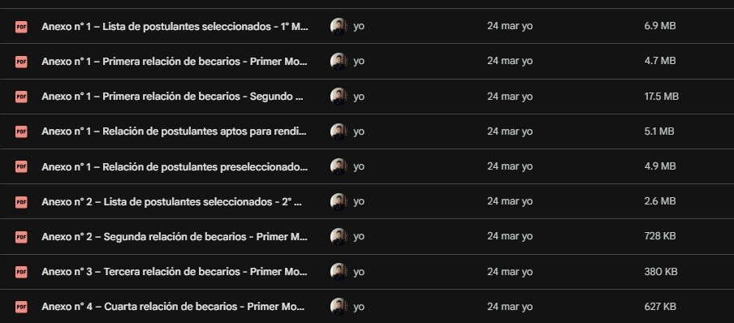

# 🎓 Beca 18 Analytics  
## Proyecto SQL: Análisis del proceso de selección de becarios en Perú

---

## 📌 Resumen (Overview)

El programa **Beca 18** busca brindar oportunidades educativas a jóvenes talentosos en situación vulnerable en Perú. Sin embargo, el proceso de selección involucra múltiples etapas (aptos, preseleccionados, seleccionados y becarios), lo que dificulta entender el comportamiento de los postulantes y la eficiencia del sistema.

El objetivo de este proyecto es construir un análisis end-to-end utilizando **Python y SQL Server**, para transformar datos extraídos desde PDFs oficiales en información accionable que permita:

- Entender el funnel de postulantes
- Evaluar tasas de conversión
- Identificar patrones de éxito
- Detectar oportunidades de mejora en el proceso

---

## 🧠 Objetivos del Proyecto

- Analizar la evolución de postulantes a través de las etapas del concurso
- Identificar qué modalidades, regiones y universidades tienen mayor éxito
- Evaluar qué tan competitivo es el proceso por carrera
- Detectar comportamientos como cambios de carrera o abandono del proceso
- Generar insights basados en datos para toma de decisiones

---

## 🛠️ Tecnologías Utilizadas

- **Python (Google Colab)** → Extracción de datos desde PDFs
- **pdfplumber / pandas** → Limpieza y transformación
- **SQL Server** → Modelado y análisis
- **GitHub** → Documentación y versionamiento

---

## 🔄 Pipeline del Proyecto

### 🔹 1. Extracción de Datos (Python)

Los datos fueron extraídos desde documentos oficiales en formato PDF (más de 400 páginas) utilizando `pdfplumber`.

Se realizaron:
- Lectura automatizada de tablas
- Manejo de estructuras variables
- Corrección de errores de formato (saltos de línea, columnas adicionales)
- Normalización de texto



```python
----
with pdfplumber.open(ruta_aptos) as pdf:
    for i, page in enumerate(tqdm(pdf.pages)):
        try:
            table = page.extract_table()

            if table:
                for row in table[1:]:  # ignoramos encabezados del PDF
                    Aptos.append(row)

        except Exception as e:
            print(f"Error en página {i}: {e}")

# Crear DataFrame SIN usar encabezados del PDF
df_aptos = pd.DataFrame(Aptos)

# Asignar encabezados normalizados
df_aptos.columns = ["N", "MODALIDAD", "DNI", "NOMBRES", "RESULTADO"]

```
---

### 🔹 2. Transformación (Data Cleaning)

Se aplicaron reglas como:

- Eliminación de registros inválidos
- Normalización de modalidades (ej: *BECA CNA Y PA*)
- Conversión de tipos de datos (strings → numéricos)
- Eliminación de duplicados
- Estandarización de DNIs

```python
----
with pdfplumber.open(ruta_aptos) as pdf:
    for i, page in enumerate(tqdm(pdf.pages)):
        try:
            table = page.extract_table()

            if table:
                for row in table[1:]:  # ignoramos encabezados del PDF
                    Aptos.append(row)

        except Exception as e:
            print(f"Error en página {i}: {e}")

# Crear DataFrame SIN usar encabezados del PDF
df_aptos = pd.DataFrame(Aptos)

# Asignar encabezados normalizados
df_aptos.columns = ["N", "MODALIDAD", "DNI", "NOMBRES", "RESULTADO"]

---

### 🔹 3. Carga de Datos (SQL Server)

Los datos fueron cargados mediante `BULK INSERT` en las siguientes tablas:

- `aptos`
- `preseleccionados`
- `seleccionados`
- `seleccionados_final`
- `becarios`

Se aplicaron validaciones de calidad:
- Unicidad de DNI
- Integridad entre etapas
- Consistencia de datos

---

### 🔹 4. Modelado

Se construyó un modelo relacional basado en el **DNI como clave principal**, permitiendo conectar todas las etapas del proceso.

---

## 📊 Análisis Exploratorio e Insights

---

### 🔍 Pregunta #1: ¿Cuántos postulantes hay en cada etapa?

📌 **Objetivo:**  
Entender la magnitud del proceso y la reducción de postulantes en cada fase.

📊 Insight:
Se evidencia un **fuerte filtro progresivo**, lo cual confirma la alta competitividad del programa.

---

### 🔍 Pregunta #2: ¿Cómo es el funnel por modalidad?

📌 **Objetivo:**  
Evaluar qué modalidades tienen mayor tasa de éxito.

📊 Insight:
Existen diferencias claras en tasas de conversión, lo que puede indicar **brechas estructurales o ventajas por modalidad**.

---

### 🔍 Pregunta #3: ¿Cómo evolucionan los postulantes por región?

📌 **Objetivo:**  
Identificar desigualdades geográficas en el acceso a la beca.

📊 Insight:
Algunas regiones presentan mejor conversión, lo que puede estar relacionado con acceso a preparación o recursos educativos.

---

### 🔍 Pregunta #4: ¿Qué universidades tienen más becarios?

📌 **Objetivo:**  
Detectar instituciones con mayor captación de talento becado.

📊 Insight:
Se identifican universidades líderes, lo que sugiere **preferencias o mayor oferta académica competitiva**.

---

### 🔍 Pregunta #5: ¿Qué regiones generan más becarios?

📌 **Objetivo:**  
Evaluar eficiencia regional.

📊 Insight:
No siempre las regiones con más postulantes generan más becarios → **calidad vs cantidad**.

---

### 🔍 Pregunta #6: ¿Cuál es la carrera más competitiva?

📌 **Objetivo:**  
Medir qué carreras requieren mayor puntaje.

📊 Insight:
Las carreras con mayor puntaje promedio reflejan **alta demanda y competencia**.

---

### 🔍 Pregunta #7: Funnel por universidad

📌 **Objetivo:**  
Analizar el flujo completo por institución.

📊 Insight:
Algunas universidades tienen alta conversión → podrían ser **más accesibles o mejor preparadas para el proceso**.

---

### 🔍 Pregunta #8: ¿Qué pasa con los mejores preseleccionados?

📌 **Objetivo:**  
Evaluar si los mejores puntajes llegan a ser becarios.

📊 Insight:
No todos los altos puntajes terminan siendo becarios → influyen otras variables (elección, vacantes, estrategia).

---

### 🔍 Pregunta #9: Cambios de carrera

📌 **Objetivo:**  
Analizar comportamiento estratégico del postulante.

📊 Insight:
Algunos postulantes cambian de carrera para mejorar sus probabilidades, pero esto no garantiza éxito.

---

### 🔍 Pregunta #10: Impacto del cambio de carrera

📌 **Objetivo:**  
Evaluar si cambiar de carrera ayuda a obtener la beca.

📊 Insight:
Una proporción relevante de quienes cambian **no logra la beca**, lo que sugiere decisiones no óptimas.

---

## 📈 Ejemplos de Resultados

_(Agregar capturas en la carpeta /images)_

```markdown


